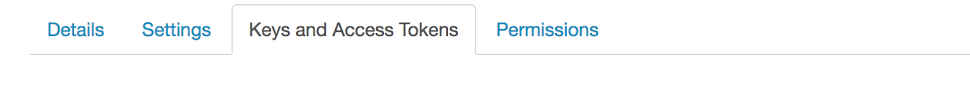
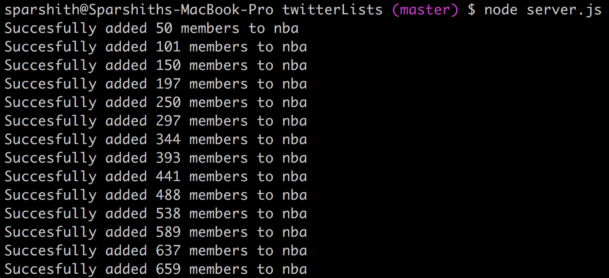
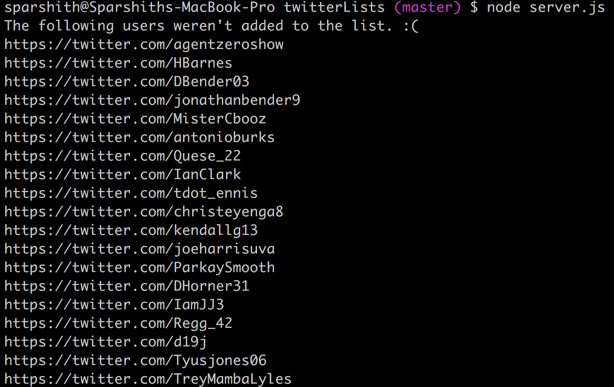

# create-twitter-lists

## Steps to use this module

### 1. Create a twitter app on https://apps.twitter.com/

### 2. Navigate to "Keys and Access Tokens" tab.

### 3. You need to copy 4 values from this page - 
	1. consumer_key
	2. consumer_secret
	3. access_token_key
	4. access_token_secret
	
### 4. Other details you need to fetch from twitter - 
	1. List name: This is technically not the name. Insert the last part of the url of the list here.
	2. Your handle/screen name.

### 5. Add these values to corresponding fields in config.js

### 6. Remove example contents in members.csv, and add screen names of users you want to add to the list in the same comma seperated value format.

### 7. Navigate to root directory, and execute "node server.js".

## Expected output
This will output the total number of members added to your list, as well links to omitted ones(Mostly due to the users having protected accounts, or invalid screen names) on the console.

## Important notes

### Rate limit
Although there's no rate limit mentioned in the docs, I strongly suggest you limit number of members added to a maximum of 1000 per day. Twitter is known to block this action, post that number.
